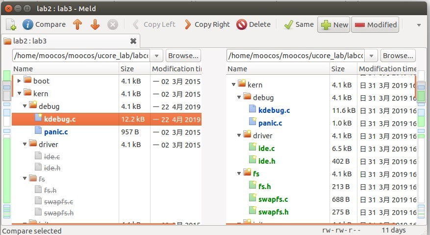
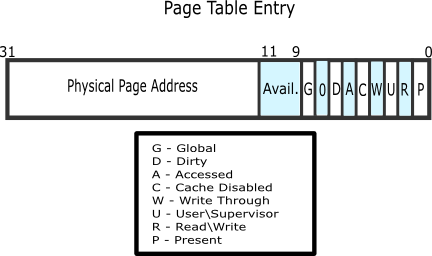
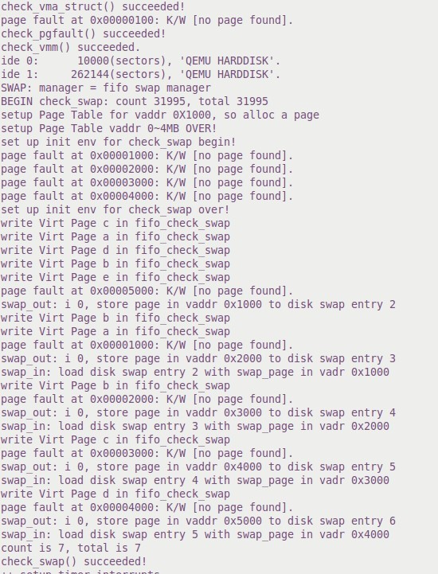
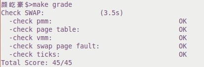

# lab3  
## 【实验题目】
实验 4 虚拟内存管理  
## 【实验目的】  
1. 了解虚拟内存的 Page Fault 异常处理实现
2. 了解页替换算法在操作系统中的实现
## 【实验要求】
    练习 0 ：填写已有实验  
    练习 1 ：给未被映射的地址映射上物理页（需要编程  
    练习 2 ：补充完成基于 FIFO 的页面替换算法（需要编程）  

## 【实验方案】
**练习 0**  
这里使用的是系统自带的meld 工具进行整合，只需要选择两个文件夹，然后进行比较，在需要修改的文件中点击 Compare, 填充代码。  
  
**练习 1**   
do_pgfault 函数是这次要填写的内容 
```c
/* do_pgfault - interrupt handler to process the page fault execption
 * @mm         : the control struct for a set of vma using the same PDT
 * @error_code : the error code recorded in trapframe->tf_err which is setted by x86 hardware
 * @addr       : the addr which causes a memory access exception, (the contents of the CR2 register)
 *
 * CALL GRAPH: trap--> trap_dispatch-->pgfault_handler-->do_pgfault
 * The processor provides ucore's do_pgfault function with two items of information to aid in diagnosing
 * the exception and recovering from it.
 *   (1) The contents of the CR2 register. The processor loads the CR2 register with the
 *       32-bit linear address that generated the exception. The do_pgfault fun can
 *       use this address to locate the corresponding page directory and page-table
 *       entries.
 *   (2) An error code on the kernel stack. The error code for a page fault has a format different from
 *       that for other exceptions. The error code tells the exception handler three things:
 *         -- The P flag   (bit 0) indicates whether the exception was due to a not-present page (0)
 *            or to either an access rights violation or the use of a reserved bit (1).
 *         -- The W/R flag (bit 1) indicates whether the memory access that caused the exception
 *            was a read (0) or write (1).
 *         -- The U/S flag (bit 2) indicates whether the processor was executing at user mode (1)
 *            or supervisor mode (0) at the time of the exception.
 */
``` 
用于处理 page fault 产生的异常，其中异常主要分为三种，页不存在、页在外存、没有权限等。   
在函数中出现两个新出现的结构体  	mm_struct： 
```c
// the control struct for a set of vma using the same PDT
struct mm_struct {
    list_entry_t mmap_list;        // linear list link which sorted by start addr of vma
    struct vma_struct *mmap_cache; // current accessed vma, used for speed purpose
    pde_t *pgdir;                  // the PDT of these vma
    int map_count;                 // the count of these vma
    void *sm_priv;                   // the private data for swap manager
};
```  
很显然，它是同一个页表目录项下所有 vma 的控制单元，首先包含了一个链表节点指向 vma，一个充当 cache 的 vma_struct 指针，PDT 的指针，vma 数量以及swap manager。  
vm_struct  
```c
// the virtual continuous memory area(vma), [vm_start, vm_end), 
// addr belong to a vma means  vma.vm_start<= addr <vma.vm_end 
struct vma_struct {
    struct mm_struct *vm_mm; // the set of vma using the same PDT 
    uintptr_t vm_start;      // start addr of vma      
    uintptr_t vm_end;        // end addr of vma, not include the vm_end itself
    uint32_t vm_flags;       // flags of vma
    list_entry_t list_link;  // linear list link which sorted by start addr of vma
};

```
表示一个连续的虚拟内存块，包含 PDT 指针，首地址，尾地址等。 
 
练习 1 的注释： 
```c
/*LAB3 EXERCISE 1: YOUR CODE
    * Maybe you want help comment, BELOW comments can help you finish the code
    *
    * Some Useful MACROs and DEFINEs, you can use them in below implementation.
    * MACROs or Functions:
    *   get_pte : get an pte and return the kernel virtual address of this pte for la
    *             if the PT contians this pte didn't exist, alloc a page for PT (notice the 3th parameter '1')
    *   pgdir_alloc_page : call alloc_page & page_insert functions to allocate a page size memory & setup
    *             an addr map pa<--->la with linear address la and the PDT pgdir
    * DEFINES:
    *   VM_WRITE  : If vma->vm_flags & VM_WRITE == 1/0, then the vma is writable/non writable
    *   PTE_W           0x002                   // page table/directory entry flags bit : Writeable
    *   PTE_U           0x004                   // page table/directory entry flags bit : User can access
    * VARIABLES:
    *   mm->pgdir : the PDT of these vma
    *
    */
```  
可以看到练习 1 的目的是要获得 PTE，如果不存在则新建一个 PT，因而可以使用 get_pte 函数来实现，如果获得的 PTE 为空，则为其分配一个页并修改页表完成虚地址对物理地址的映射，使用 pgdir_alloc_page 函数实现。除此之外还要注意处理函数调用的错误信息。 
```c
    //(1) try to find a pte, if pte's PT(Page Table) isn't existed, then create a PT.
    if ((ptep = get_pte(mm->pgdir, addr, 1)) == NULL){
        goto failed;
    }
    //(2) if the phy addr isn't exist, then alloc a page & map the phy addr with logical addr
    if (*ptep == 0) {
        if(pgdir_alloc_page(mm->pgdir, addr, perm) == NULL)
            goto failed;
    }
```
  
**问题 1**：请描述页目录项（Page Directory Entry）和页表项（Page Table Entry）中组成部分对 ucore 实现页替换算法的潜在用处。 
页表项与页目录项相似   

高 20 位用于存储物理页的地址，而低 12 位作为功能位在 mmu.h 我们可以找到 PTE 和 PDE 的功能信息 
```
 	PTE_P 	 	物理页是否存在 
 	PTE_W  	物理页是否可写 
 	PTE_U 	 	用户态是否可访问 
 	PTE_PWT 	物理页是否为写直达，可以向更低级的储存设备写入 
 	PTE_PCD  	物理页是否可以放入缓存 
 	PTE_A 	 	物理页是否可被访问 
 	PTE_D 	 	物理页是否可被写 
 	PTE_PS  	物理页大小 
 	PTE_MBZ 	必须为 0 
 	PTE_AVAIL 	由软件自定 
```
这些功能位是判断是否出现页错误和是否被替换的重要依据 
页目录项存储了所有页物理地址与虚拟地址的对应，而页表项则存储这些页的信息。   
**问题 2**：如果 ucore 的缺页服务例程在执行过程中访问内存，出现了页访问异常，请问硬件要做哪些事情？  
CPU 会把产生异常的线性地址存储在 CR2 中，并且把表示页访问异常类型的值（简称页访问异常错误码，errorCode）保存在中断栈中。然后调用 do_pgfault 进行处理。   
**练习 2： **  
练习 2 要实现的是基于 FIFO 的页面替换算法，首先要填补的还是 do_pgfault 函数  
```c
#if 0
    /*LAB3 EXERCISE 1: YOUR CODE*/
    ptep = ???              //(1) try to find a pte, if pte's PT(Page Table) isn't existed, then create a PT.
    if (*ptep == 0) {
                            //(2) if the phy addr isn't exist, then alloc a page & map the phy addr with logical addr

    }
    else {
    /*LAB3 EXERCISE 2: YOUR CODE
    * Now we think this pte is a  swap entry, we should load data from disk to a page with phy addr,
    * and map the phy addr with logical addr, trigger swap manager to record the access situation of this page.
    *
    *  Some Useful MACROs and DEFINEs, you can use them in below implementation.
    *  MACROs or Functions:
    *    swap_in(mm, addr, &page) : alloc a memory page, then according to the swap entry in PTE for addr,
    *                               find the addr of disk page, read the content of disk page into this memroy page
    *    page_insert ： build the map of phy addr of an Page with the linear addr la
    *    swap_map_swappable ： set the page swappable
    */
        if(swap_init_ok) {
            struct Page *page=NULL;
                                    //(1）According to the mm AND addr, try to load the content of right disk page
                                    //    into the memory which page managed.
                                    //(2) According to the mm, addr AND page, setup the map of phy addr <---> logical addr
                                    //(3) make the page swappable.
        }
        else {
            cprintf("no swap_init_ok but ptep is %x, failed\n",*ptep);
            goto failed;
        }
   }
#endif
```  
代码的流程大致为：首先对 swap 进行初始化，成功后根据 mm 和 addr 将正确的磁盘中的页换到 page 中（swap_in 函数），换取成功后建立虚拟地址到物理地址的映射(page_insert 函数)，最后完成页置换(swap_map_swappable)。 
根据此流程编写代码如下  
```c
if(swap_init_ok){
            struct Page *page = NULL;
            if((ret = swap_in(mm,addr,&page))!=0)   //(1）According to the mm AND addr, try to load the content of right disk page
                goto failed;                        //    into the memory which page managed.
            page_insert(mm->pgdir,page,addr,perm);  //(2) According to the mm, addr AND page, setup the map of phy addr <---> logical addr
            swap_map_swappable(mm,addr,page,1);
            page->pra_vaddr = addr;                 //(3) make the page swappable.
        }else{
            cprintf("no swap_init_ok but ptep is %x, failed\n", *ptep);
            goto failed;
        }
```
接下来需要完成 map_swappable 和 swap_out_victim 函数   
map_swappable 是将最近使用的页加入到 pra_list_head 队列中，需要我们完成的代码只有添加部分  
```c
/*LAB3 EXERCISE 2: YOUR CODE*/ 
    //(1)link the most recent arrival page at the back of the pra_list_head qeueue.
    list_add(head, entry);
```
swap_out_victim 则是选择将要被置换的页，因为使用的 FIFO，因此会找到最先进入队列的页，进行置换。  
```c
/*LAB3 EXERCISE 2: YOUR CODE*/ 
     //(1)  unlink the  earliest arrival page in front of pra_list_head qeueue
     //(2)  set the addr of addr of this page to ptr_page
     list_entry_t *entry = head->prev;
     struct Page *page = le2page(entry,pra_page_link); 
     list_del(entry);
     *ptr_page = page;
     return 0;
```  
**问题1**  
如果要在 ucore 上实现“extended clock 页替换算法”请给你的设计方案，现有的 swap_manager 框架是否足以支持在 ucore 中实现此算法？如果是，请给你的设计方案。   
在练习 1 中我们看到页表中拥有 access,和 dirty 位，利用这两个功能位就可以检测页表是否被访问过或者被修改过，从而完成 extended clock 页替换算法 
1.	需要被换出的页的特征是什么？  
最早被加入且未被访问过的页表。 
2.	在 ucore 中如何判断具有这样特征的页？  
将页表与 PTE_A 相与，若为 0，则未被访问过 
3.	何时进行换入和换出操作？  
所需的页不在页表中且页表已满 
## 【实验过程】 
完成代码编写后，在命令行使用 make qemu, 结果如下 
  
出现了一次探测页错误的过程与 5 次页置换过程。   
check_pgfault() succeeded!与 check_swap() succeeded!成功输出，结果正确  
 
make grade 成功通过 
