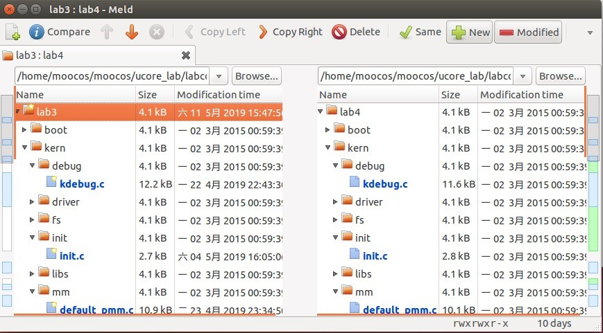
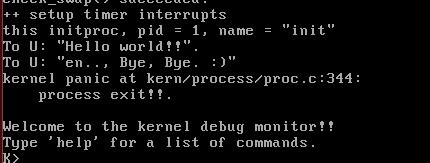

# lab4
## 【实验题目】实验 5 内核线程管理 
## 【实验目的】  
了解内核线程创建/执行的管理过程  了解内核线程的切换和基本调度过程 
## 【实验要求】 
    •	为了实现实验的目标，实验提供了 3 个基本练习和 2 个扩展练习，要求完成实验报告。 
    •	练习 0：填写已有实验 
    •	练习 1：分配并初始化一个进程控制块（需要编码） 
    •	练习 2：为新创建的内核线程分配资源（需要编程） 
    •	练习 3：阅读代码，理解 proc_run 函数和它调用的函数如何完成进程切换的。 （无需编程） 
    •	选做 
    •	扩展练习 Challenge：实现支持任意大小的内存分配算法  
## 【实验方案】  
**练习 0：**   
 使用 meld 工具进行整合合并，对比 lab3 和 lab4 两个文件夹，对有区别的文件一一比较添加 lab3 的代码 

**练习 1: **
alloc_proc 函数（位于 kern/process/proc.c 中）负责分配并返回一个新的 struct proc_struct 结构，用于存储新建立的内核线程的管理信息。ucore 需要对这个结构进行最基本的初始化。   
proc.c 中相关注释: 
```c
    //LAB4:EXERCISE1 YOUR CODE
    /*
     * below fields in proc_struct need to be initialized
     *       enum proc_state state;                      // Process state
     *       int pid;                                    // Process ID
     *       int runs;                                   // the running times of Proces
     *       uintptr_t kstack;                           // Process kernel stack
     *       volatile bool need_resched;                 // bool value: need to be rescheduled to release CPU?
     *       struct proc_struct *parent;                 // the parent process
     *       struct mm_struct *mm;                       // Process's memory management field
     *       struct context context;                     // Switch here to run process
     *       struct trapframe *tf;                       // Trap frame for current interrupt
     *       uintptr_t cr3;                              // CR3 register: the base addr of Page Directroy Table(PDT)
     *       uint32_t flags;                             // Process flag
     *       char name[PROC_NAME_LEN + 1];               // Process name
     */
```
可以看到我们需要对 proc_struct 的相关成员初始化。 
其中大部分成员都只需要置空即可，需要特殊设置的     
```c
proc->state = PROC_UNINIT;     proc->pid = -1; 
proc->cr3 = boot_cr3; 
```
新创建的线程还未被初始化，所以 state 应置为 PROC_UNINIT，id 同理。 
cr3 中含有页目录表物理内存基地址，而 boot_cr3 指向了 uCore 启动时建立好的饿内核虚拟空间的页目录表首地址。因此将 cr3 指向 boot_cr3   
代码如下 
```c
    proc->state = PROC_UNINIT;
    proc->pid = -1;
    proc->runs = 0;
    proc->kstack = 0;
    proc->need_resched = 0;
    proc->parent = NULL;
    proc->mm = NULL;
    memset(&(proc->context), 0, sizeof(proc->context));
    proc->tf = NULL;
    proc->cr3 = boot_cr3;
    proc->flags = 0;
    memset(proc->name, 0, PROC_NAME_LEN);
```  
**context 的作用 **
在指导书中能够看到这些定义：   
进程的上下文，用于进程切换（参见 switch.S）。在 uCore 中，所有的进程在内核中也是相对独立的（例如独立的内核堆栈以及上下文等等）。使用 context 保存寄存器的目的就在于在内核态中能够进行上下文之间的切换。实际利用 context 进行上下文切换的函数是在 kern/process/switch.S 中定义 switch_to。   
我们可以在 proc.h 中找到 context 的定义 
```c
struct context {
    uint32_t eip;
    uint32_t esp;
    uint32_t ebx;
    uint32_t ecx;
    uint32_t edx;
    uint32_t esi;
    uint32_t edi;
    uint32_t ebp;
};
``` 
可以看到 context 中包含了各寄存器的值，用来保存上下文的寄存器值以方便上下文的切换。 
**tf 的作用**  
在指导书中有这些定义：  
中断帧的指针，总是指向内核栈的某个位置：当进程从用户空间跳到内核空间时，中断帧记录了进程在被中断前的状态。当内核需要跳回用户空间时，需要调整中断帧以恢复让进程继续执行的各寄存器值。除此之外，uCore 内核允许嵌套中断。因此为了保证嵌套中断发生时 tf 总是能够指向当前的 trapframe，uCore 在内核栈上维护了 tf 的链，可以参考 trap.c::trap 函数做进一步的了解。  
在 trap.h 中 
```c
struct pushregs {
    uint32_t reg_edi;
    uint32_t reg_esi;
    uint32_t reg_ebp;
    uint32_t reg_oesp;          /* Useless */
    uint32_t reg_ebx;
    uint32_t reg_edx;
    uint32_t reg_ecx;
    uint32_t reg_eax;
};

struct trapframe {
    struct pushregs tf_regs;
    uint16_t tf_gs;
    uint16_t tf_padding0;
    uint16_t tf_fs;
    uint16_t tf_padding1;
    uint16_t tf_es;
    uint16_t tf_padding2;
    uint16_t tf_ds;
    uint16_t tf_padding3;
    uint32_t tf_trapno;
    /* below here defined by x86 hardware */
    uint32_t tf_err;
    uintptr_t tf_eip;
    uint16_t tf_cs;
    uint16_t tf_padding4;
    uint32_t tf_eflags;
    /* below here only when crossing rings, such as from user to kernel */
    uintptr_t tf_esp;
    uint16_t tf_ss;
    uint16_t tf_padding5;
} __attribute__((packed));

```  
因此我们可以发现 tf 用于中断时保存寄存的值，便于恢复现场。 
**练习 2：**  
do_folk 是为了给新创建的线程分配资源，按照注释和手册编写代码比较简单，但是有几个地方需要注意： 
1.	在函数为有几个标记，其中 bad_fork_cleanup_kstack，bad_fork_cleanup_proc 并未被用到，因此推测这些标记能被用于代码中。bad_fork_cleanup_proc，是释放线程，而 bad_fork_cleanup_kstack 则会对 kstack 也进行操作。因此在 setup_kstack 后的代码如果出错则需要跳转到 bad_fork_cleanup_kstack。 
2.	hash_list 和 proc_list 是两个全局链表，要考虑到互斥问题，操作时需将中断关闭，否则会产生错误。 

代码： 
```c
    proc = alloc_proc();                  //call alloc_proc to allocate a proc_struct
    if(setup_kstack(proc)!=0)             //setup_kstack to allocate a kernel stack for child process 
        goto bad_fork_cleanup_proc;       
    if(copy_mm(clone_flags, proc)!=0)     //call copy_mm to dup OR share mm according clone_flag
        goto bad_fork_cleanup_kstack;
    copy_thread(proc, stack, tf);         //call copy_thread to setup tf & context in proc_struct
    bool intr_flag; 
    local_intr_save(intr_flag);
    {
        proc->pid = get_pid();
        hash_proc(proc);
        list_add(&proc_list,&(proc->list_link));//insert proc_struct into hash_list && proc_list
        nr_process ++;
    }
    local_intr_restore(intr_flag);        //call wakup_proc to make the new child process RUNNABLE
    wakeup_proc(proc);
    ret = proc->pid;  
```  
请说明 ucore 是否做到给每个新 fork 的线程一个唯一的 id？请说明你的分析和理由。  
找到 get_pid 函数   
```c
static int
get_pid(void) {
    static_assert(MAX_PID > MAX_PROCESS);
    struct proc_struct *proc;
    list_entry_t *list = &proc_list, *le;
    static int next_safe = MAX_PID, last_pid = MAX_PID;
    if (++ last_pid >= MAX_PID) {
        last_pid = 1;
        goto inside;
    }
    if (last_pid >= next_safe) {
    inside:
        next_safe = MAX_PID;
    repeat:
        le = list;
        while ((le = list_next(le)) != list) {
            proc = le2proc(le, list_link);
            if (proc->pid == last_pid) {
                if (++ last_pid >= next_safe) {
                    if (last_pid >= MAX_PID) {
                        last_pid = 1;
                    }
                    next_safe = MAX_PID;
                    goto repeat;
                }
            }
            else if (proc->pid > last_pid && next_safe > proc->pid) {
                next_safe = proc->pid;
            }
        }
    }
    return last_pid;
}
```
可以看到 get_pid 函数有做规避重复的措施，因此只要 get_pid 互斥（例如关闭中断），就可以保证 pid 唯一。  
**练习3**  
proc_run:  
```c
void
proc_run(struct proc_struct *proc) {
    if (proc != current) {
        bool intr_flag;
        struct proc_struct *prev = current, *next = proc;
        local_intr_save(intr_flag);
        {
            current = proc;
            load_esp0(next->kstack + KSTACKSIZE);
            lcr3(next->cr3);
            switch_to(&(prev->context), &(next->context));
        }
        local_intr_restore(intr_flag);
    }
}
```
proc_run 用于使一个线程在 CPU 中运行，可以看到它的主要过程为： 
1.	将当前进程设为传入的进程 
2.	修改 esp 指针的值 
3.	修改页表项 
4.	使用 switch_to 进行上下文切换。 

switch_to:  
```AT&T
switch_to:                      # switch_to(from, to)

    # save from's registers
    movl 4(%esp), %eax          # eax points to from
    popl 0(%eax)                # save eip !popl
    movl %esp, 4(%eax)
    movl %ebx, 8(%eax)
    movl %ecx, 12(%eax)
    movl %edx, 16(%eax)
    movl %esi, 20(%eax)
    movl %edi, 24(%eax)
    movl %ebp, 28(%eax)

    # restore to's registers
    movl 4(%esp), %eax          # not 8(%esp): popped return address already
                                # eax now points to to
    movl 28(%eax), %ebp
    movl 24(%eax), %edi
    movl 20(%eax), %esi
    movl 16(%eax), %edx
    movl 12(%eax), %ecx
    movl 8(%eax), %ebx
    movl 4(%eax), %esp

    pushl 0(%eax)               # push eip

    ret
```
首先把当前寄存器的值送到原线程的 context 中保存，再将新线程的 context 赋予各寄存器。   
**在本实验的执行过程中，创建且运行了几个内核线程？**
通过对指导书的学习发现有两个内核线程:   
**创建第0个内核线程idleproc**。在 init.c::kern_init 函数调用了 proc.c::proc_init 函数。 proc_init 函数启动了创建内核线程的步骤。首先当前的执行上下文（从 kern_init 启动至今）就可以看成是 uCore 内核（也可看做是内核进程）中的一个内核线程的上下文。为此，uCore 通过给当前执行的上下文分配一个进程控制块以及对它进行相应初始化，将其打造成第 0 个内核线程 -- idleproc。  
**创建第 1 个内核线程 initproc**。第 0 个内核线程主要工作是完成内核中各个子系统的初始化，然后就通过执行 cpu_idle 函数开始过退休生活了。所以 uCore 接下来还需创建其他进程来完成各种工作，但 idleproc 内核子线程自己不想做，于是就通过调用 kernel_thread 函数创建了一个内核线程 init_main。在实验四中，这个子内核线程的工作就是输出一些字符串，然后就返回了（参看 init_main 函数）。但在后续的实验中，init_main 的工作就是创建特定的其他内核线程或用户进程（实验五涉及）。  
**语句 local_intr_save(intr_flag); ....local_intr_restore(intr_flag); 在这里有何作用?请说明理由。**  
关闭中断和打开中断。有些过程是互斥的，只允许一个线程进入，因此需要关闭中断来处理临界区。 
## 【实验过程】  

 
