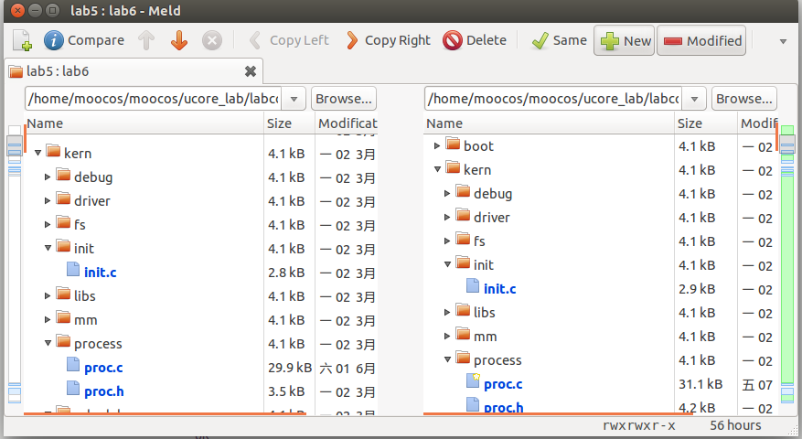
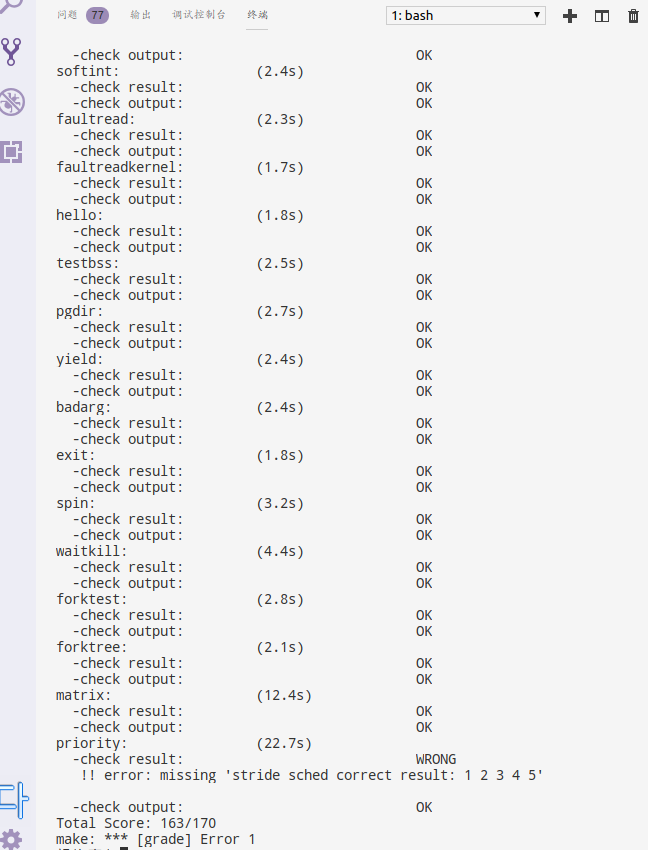
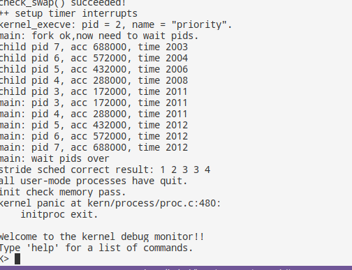
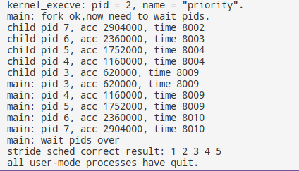
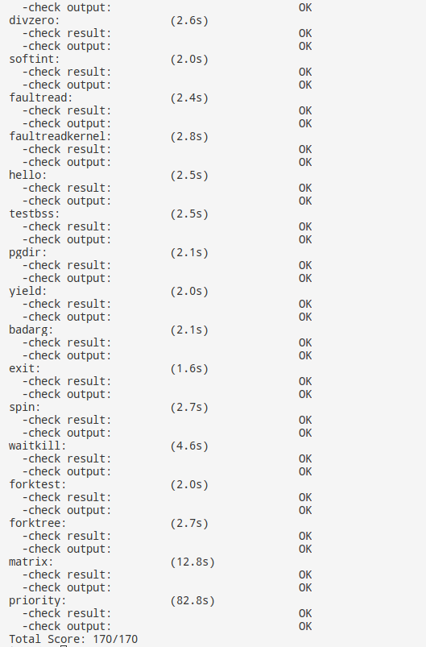

# lab6
## 【实验题目】实验7：调度器
## 【实验目的】
    •	理解操作系统的调度管理机制
    •	熟悉 ucore 的系统调度器框架，以及缺省的Round-Robin 调度算法
    •	基于调度器框架实现一个(Stride Scheduling)调度算法来替换缺省的调度算法  

## 【实验要求】
    •	为了实现实验的目标，实验提供了3个基本练习和2个扩展练习，要求完成实验报告。
    •	练习0：填写已有实验
    •	练习1：使用 Round Robin 调度算法（不需要编码）
    •	练习2：实现 Stride Scheduling 调度算法（需要编码）
    •	练习3：阅读分析源代码，结合中断处理和调度程序，再次理解进程控制块中的trapframe和context在进程切换时作用（不需要编码）  

## 【实验方案】
### **练习0**：  
合并代码使用meld工具

部分函数需要被修改  
**alloc_proc**:  
被添加的部分为  
```c
    list_init(&(proc->run_link));
    proc->time_slice = 0;
    memset(&(proc->lab6_run_pool), 0, sizeof(proc->lab6_run_pool));
    proc->lab6_stride = 0;
    proc->lab6_priority = 0;
```
新加的代码用于初始化运行队列，时间片，运行池的节点，已走的步长和优先级。  
**trap_dispatch**:  
被修改的部分为
```c
        //print_ticks();
        assert(current!=NULL);
        //current->need_resched = 1;
        run_timer_list();
```
每次时钟中断都执行一次run_timer_list。  
### **练习1**：    
（不需要编程）  

    •	完成练习0后，建议大家比较一下（可用kdiff3等文件比较软件）个人完成的lab5和练习0完成后的刚修改的lab6之间的区别，分析了解lab6采用RR调度算法后的执行过程。执行make grade，大部分测试用例应该通过。但执行priority.c应该过不去。
    •	请在实验报告完成下面要求：
    •	请理解并分析sched_calss中各个函数指针的用法，并接合Round Robin 调度算法描述ucore的调度执行过程
    •	请在实验报告中简要说明如何设计实现”多级反馈队列调度算法“，给出概要设计，鼓励给出详细设计  

（1）在sched.h中我们可以找到sched_class的定义
```c
struct sched_class {
    // the name of sched_class
    const char *name;
    // Init the run queue
    void (*init)(struct run_queue *rq);
    // put the proc into runqueue, and this function must be called with rq_lock
    void (*enqueue)(struct run_queue *rq, struct proc_struct *proc);
    // get the proc out runqueue, and this function must be called with rq_lock
    void (*dequeue)(struct run_queue *rq, struct proc_struct *proc);
    // choose the next runnable task
    struct proc_struct *(*pick_next)(struct run_queue *rq);
    // dealer of the time-tick
    void (*proc_tick)(struct run_queue *rq, struct proc_struct *proc);
    /* for SMP support in the future
     *  load_balance
     *     void (*load_balance)(struct rq* rq);
     *  get some proc from this rq, used in load_balance,
     *  return value is the num of gotten proc
     *  int (*get_proc)(struct rq* rq, struct proc* procs_moved[]);
     */
};
```  
其中包含了调度方法的名字、运行队列指针与四个函数指针，四个函数指针作为接口从而可以实现不同的调度方法（例如RR与Stride），四个接口的用途总结如下：  

	enqueue: 入队，将进程放入调度队列中。
	dequeue: 出队，将进程从调度队列中移除
	pick_next: 选取，选择下一个将被运行的进程。
	proc_tick: 触发，检测是否需要调度  

接下来结合RR算法来分析Ucore的调度过程  
**RR_init**:
```c
static void
RR_init(struct run_queue *rq) {
    list_init(&(rq->run_list));
    rq->proc_num = 0;
}
```
用于初始化运行队列，调用list_init来初始化，同时将队列进程数设为0  
**RR_enqueue**:
```c
static void
RR_enqueue(struct run_queue *rq, struct proc_struct *proc) {
    assert(list_empty(&(proc->run_link)));
    list_add_before(&(rq->run_list), &(proc->run_link));
    if (proc->time_slice == 0 || proc->time_slice > rq->max_time_slice) {
        proc->time_slice = rq->max_time_slice;
    }
    proc->rq = rq;
    rq->proc_num ++;
}
```
RR入队函数，将新加进来的队列放到运行队列的末尾，符合FIFO，将进程的队列指针指向当前队列，最后使队列数自增。  
**RR_dequeue**:
```c
static void
RR_dequeue(struct run_queue *rq, struct proc_struct *proc) {
    assert(!list_empty(&(proc->run_link)) && proc->rq == rq);
    list_del_init(&(proc->run_link));
    rq->proc_num --;
}
```
RR出队函数，把运行队列的第一个进程去除，并且进程数减一。  
**RR_pick_next**:  
```c
static struct proc_struct *
RR_pick_next(struct run_queue *rq) {
    list_entry_t *le = list_next(&(rq->run_list));
    if (le != &(rq->run_list)) {
        return le2proc(le, run_link);
    }
    return NULL;
}
```
RR选取进程函数，根据FIFO，选取rq的第一个就绪进程作为下一个进程。  
**RR_proc_tick**:  
```c
static void
RR_proc_tick(struct run_queue *rq, struct proc_struct *proc) {
    if (proc->time_slice > 0) {
        proc->time_slice --;
    }
    if (proc->time_slice == 0) {
        proc->need_resched = 1;
    }
}
```
RR触发函数，首先将当前进程的时间片减一，若其已没有（或用完）可用的时间片，则说明需要调度，将need_resched设为1  
**执行过程**.  
通过这几个函数，我们可以知道在时间轮转法(RR)调度下的进程调度过程。RR算法使用一个双向链表作为运行队列，遵循FIFO的规律，后到的进程会被放在队列尾。为了实现时间轮转的功能，为proc_struct添加了一个time_slice的成员变量，其表示进程还剩余的时间片长度，每次使用proc_tick(在run_timer_list被调用)时，time_slice就会减一。如果time_slice减为0，则说明当前进程时间片用完了，需要进行调度，此时如果该进程没有执行完，就会被放到队列尾，在从队列头取一个进程执行，以达到时间轮转的目的。

（2）  

	以RR算法为蓝本进行改进实现多级反馈队列调度算法：
	a. 设置多个不同优先级的运行队列，优先调度高优先级队列中的进程。
	b. 同一个优先级队列中的进程使用RR算法进行调度。
	c. 为防止发生饥饿，每隔一定周期需将一定低优先级的进程的优先级上升
	d. 同理，当高优先级队列的一个进程占用CPU过长时，将其优先级下降

### **练习2**：  
需要编程）  

    •	首先需要换掉RR调度器的实现，即用default_sched_stride_c覆盖default_sched.c。然后根据此文件和后续文档对Stride度器的相关描述，完成Stride调度算法的实现。
    •	后面的实验文档部分给出了Stride调度算法的大体描述。这里给出Stride调度算法的一些相关的资料（目前网上中文的资料比较欠缺）。
    •	http://citeseerx.ist.psu.edu/viewdoc/summary?doi=10.1.1.138.3502&rank=1  

看实验视频  
Stride调度算法的原理是变相的优先级调度，每个进程都存在一个stride和pass（可由其优先级计算），每次调度程序将选择stride最小的进程进行运行然后将其stride增加pass，原理比较简单，Stride算法有链表与斜堆两种实现方式，这里我选择的是斜堆（因为效率更高），下面根据代码来进行分析。  
**BIG_STRIDE**:
```c
#define BIG_STRIDE  0x7FFFFFFF  /* you should give a value, and is ??? */
```
BIG_STRIDE是一个大整数，其代表着进程每次能够前进的最大步长数，将BIG_STRIDE设为0x7FFFFFFF的原因有两个：  

	a.  0x7FFFFFFF是有符号int的最大正值
	b. 与比较函数proc_stride_comp_f有关  

```c
static int
proc_stride_comp_f(void *a, void *b)
{
     struct proc_struct *p = le2proc(a, lab6_run_pool);
     struct proc_struct *q = le2proc(b, lab6_run_pool);
     int32_t c = p->lab6_stride - q->lab6_stride;
     if (c > 0) return 1;
     else if (c == 0) return 0;
     else return -1;
}
```
proc_stride_comp_f是用来比较两个进程之间stride的大小，proc_struct的lab6_stride是无符号int，这里用减法p->lab6_stride - q->lab6_stride来比较大小，其结果c是一个有符号c, 可以避免lab6_stride溢出为负数而导致错误，然而进程stride的增加仍可能导致lab6_stride继续溢出，因而有以下要求。  
假如q>=p，此时调度p，p的stride增加s的长度，若p溢出，则必须保证下一次调度时p>q，即b+s-2^32>q, 由因为b,q都为无符号数，只有q-p溢出为负数，因此s<2^31+q-p,又q>=p，因此s<2^31。  
故BIG_STRIDE的最大值为0x7FFFFFFF  

**stride_init**:
```c
static void
stride_init(struct run_queue *rq) {
     /* LAB6: YOUR CODE 
      * (1) init the ready process list: rq->run_list
      * (2) init the run pool: rq->lab6_run_pool
      * (3) set number of process: rq->proc_num to 0       
      */
    memset(&(rq->lab6_run_pool), 0, sizeof(rq->lab6_run_pool));
    rq->proc_num = 0;
}
```
初始化函数，因为只用到了斜堆，因此只需要将斜堆池lab6_run_pool初始化即可，若要用双向链表则同时需要对rq->run_list初始化。

**stride_enqueue**  
```c
	static void
stride_enqueue(struct run_queue *rq, struct proc_struct *proc) {
     /* LAB6: YOUR CODE 
      * (1) insert the proc into rq correctly
      * NOTICE: you can use skew_heap or list. Important functions
      *         skew_heap_insert: insert a entry into skew_heap
      *         list_add_before: insert  a entry into the last of list   
      * (2) recalculate proc->time_slice
      * (3) set proc->rq pointer to rq
      * (4) increase rq->proc_num
      */
    rq->lab6_run_pool = skew_heap_insert(rq->lab6_run_pool, &(proc->lab6_run_pool), proc_stride_comp_f);
    if (proc->time_slice == 0 || proc->time_slice > rq->max_time_slice)
        proc->time_slice = rq->max_time_slice;
    proc->rq = rq;
    rq->proc_num ++;
}
```
入队函数，需要做的操作即将进程的lab6_run_pool节点插入到斜堆lab6_run_pool，同时队列进程数加一

**stride_dequeue**:  
```c
static void
stride_dequeue(struct run_queue *rq, struct proc_struct *proc) {
     /* LAB6: YOUR CODE 
      * (1) remove the proc from rq correctly
      * NOTICE: you can use skew_heap or list. Important functions
      *         skew_heap_remove: remove a entry from skew_heap
      *         list_del_init: remove a entry from the  list
      */
    rq->lab6_run_pool = skew_heap_remove(rq->lab6_run_pool, &(proc->lab6_run_pool), proc_stride_comp_f);
    rq->proc_num --;
}
```
出队函数，只需将当前进程的的lab6_run_pool节点从斜堆rq->lab6_run_pool中移除即可。若使用链表实现则需要在链表中移除。最后时队列进程数减1.

**stride_pick_next**:  
```c
static struct proc_struct *
stride_pick_next(struct run_queue *rq) {
     /* LAB6: YOUR CODE 
      * (1) get a  proc_struct pointer p  with the minimum value of stride
             (1.1) If using skew_heap, we can use le2proc get the p from rq->lab6_run_poll
             (1.2) If using list, we have to search list to find the p with minimum stride value
      * (2) update p;s stride value: p->lab6_stride
      * (3) return p
      */
    if(rq->lab6_run_pool==NULL)
        return NULL;
    struct proc_struct *p = le2proc(rq->lab6_run_pool, lab6_run_pool);
    if(p->lab6_priority!=0)
        p->lab6_stride += BIG_STRIDE/p->lab6_priority;
    else
        p->lab6_stride += BIG_STRIDE;
    return p;
}
```
选取函数，因为斜堆已经对优先级进行排序了，因此不需要我们多做出里，只需要用le2proc从斜堆中提取stride最小的进程即可。  
在stride增加时使用的是p->lab6_stride += BIG_STRIDE/p->lab6_priority的方式，这样优先级高的进程每次增加的步长就少，同样的步长它就会被多调度几次。  
同时为了避免priority为0导致错误（初始化时会将priority设置为0），若为0则直接增加最大步长。  

**stride_proc_tick**:  
```c
static void
stride_proc_tick(struct run_queue *rq, struct proc_struct *proc) {
     /* LAB6: YOUR CODE */
    if(proc->time_slice>0)
        proc->time_slice--;
    if(proc->time_slice==0)
        proc->need_resched = 1;
}
```
触发函数，与RR一样，将进程时间片减小，若为0则进行调度。
	至此斜堆版本的Stride法的调度代码就实现完了。

### **练习3**：  

    •	（无编码工作）
    •	结合中断处理和调度程序，再次理解进程控制块中的trapframe和context在进程切换时作用。  

**context**:  
在调度时有这非常重要的作用。当进程时间片用完了时将唤醒Ucore进行调度，Ucore通过调度算法得到下一个将要执行的进程的proc_struct，在proc_struct中保存着上下文context。Ucore通过switch_to将当前寄存器的值存入旧进程的context中，同时将新进程的context中保存的寄存器值放入各寄存器，实现进程的切换。  
**trapframe**:  
在发生中断使得进程从用户空间跳到内核空间时，此时可能并不需要调度其他的进程，但是需要让中断帧记录下中断前的寄存器值，这样当进程跳回用户空间时可以继续执行下去。


**附priority.c**:  
在填写代码后练习2的结果，会发现priority.c通不过，因此结合priority.c的代码进行调试，期许获得理想结果。  
**make grade**  

**make run-priority**:  

	 
**结果解析（主要针对priority为wrong的情况）**：  

priority的结果为wrong，但我认为实验结果是正确的，解释如下：  
首先我们找到priority.c的代码
```c
     for (i = 0; i < TOTAL; i ++) {
          acc[i]=0;
          if ((pids[i] = fork()) == 0) {
               lab6_set_priority(i + 1);
               acc[i] = 0;
               while (1) {
                    spin_delay();
                    ++ acc[i];
                    if(acc[i]%4000==0) {
                        if((time=gettime_msec())>MAX_TIME) {
                            cprintf("child pid %d, acc %d, time %d\n",getpid(),acc[i],time);
                            exit(acc[i]);
                        }
                    }
               }
               
          }
          if (pids[i] < 0) {
               goto failed;
          }
     }
```
我们可以看到priority.c的目的是创建5个子进程，并分别将其priority设为1,2,3,4,5（pid分别为3,4,5,6,7）,我们在练习2中说过，stride的增加为BIG_STRIDE/priority，因此5个子进程的执行次数也大概会是1,2,3,4,5。我们在下面可以找到priority输出的代码。  
```c     for (i = 0; i < TOTAL; i ++)
     {
         cprintf(" %d", (status[i] * 2 / status[0] + 1) / 2);
     }
```
其中status = acc，也就是输出的值其实就是所有进程的执行次数除以priority最小的进程被执行的次数。  
因此，为什么最后的结果不是1,2,3,4,5而是1,2,3,3,4，导致priority的result为wrong呢。  
我们注意到输出结果的这部分  

    child pid 7, acc 688000, time 2003
    child pid 6, acc 572000, time 2004
    child pid 5, acc 432000, time 2006
    child pid 4, acc 288000, time 2008
    child pid 3, acc 172000, time 2011  

pid即子进程号，acc即执行次数，time为Ucore的ticks的值，因此我们发现，子进程结束的顺序是7,6,5,4,3，而结束时间分别为2003,2004,2006,2008,2011，再结合这部分代码(priority.c)  
```c
            if(acc[i]%4000==0) {
                    if((time=gettime_msec())>MAX_TIME) {
                        cprintf("child pid %d, acc %d, time %d\n",getpid(),acc[i],time);
                        exit(acc[i]);
                    }
                }
 ```
将进程执行次数除以4000我们得到以下结果   

    pid7 : 172	pid6: 143		pid5: 108		pid4: 72		pid3: 43  

用前一个值推后面一个的值计算为（括号里为与实际值的差值）  

    pid7: 172(0)	pid6: 137.6(5.4)	pid5: 107.25(0.75)	 pid4: 72(0)	pid3: 36(7)  

我们可以看到，前四个值与理论上的偏差都比较小（差值/理论值）。  
而到pid3时却出现了比较大的偏差，理论值应该为36，而实际值却是43，多次试验测试发现均出现了pid3进程执行次数偏多的情况，我们可以将其视为系统误差，Ucore会由于某些原因增加低优先级进程的调度次数。  
由此为了验证结果，我选择修改priority.c中的代码，将MAX_TIME(priority.c)从2000增加至8000,通过增加程序运行的时间以减少偶然误差的影响：  
```c
#define MAX_TIME  8000//2000
```
下面是修改以后的结果
  

可以看到成功输出1 2 3 4 5，虽然pid3还是有部分偏大，因为样本数量足够大，相对误差越来越小，因而任然能够输出1 2 3 4 5。试试make grade:
 
priority.c成功通过了,  
当然，增加MAX_TIME会导致priority.c的运行时间被显著延长(20s->80s)，但是为了得到正确的结果这是值得的。  
这也说明了，**这次实验的结果是正确的**。  

## 【实验过程】
实验环境是Ubuntu14，代码编辑工具是VSCode  
make grade(已修改priority.c的MAX_TIME到8000)  
 
make run-priority  
 
