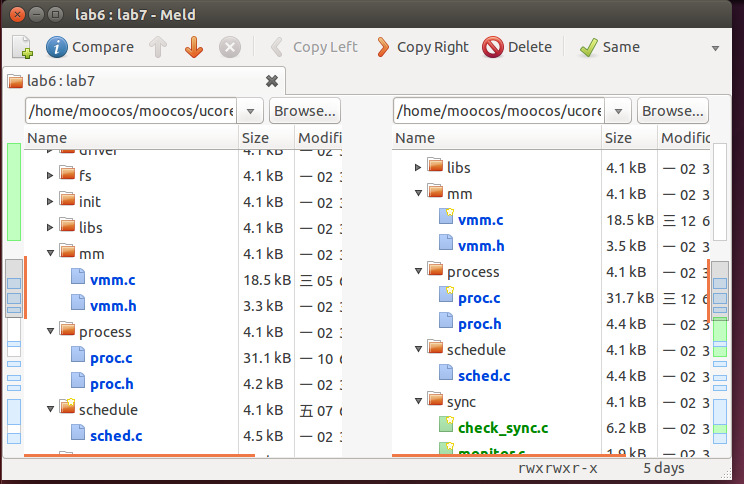
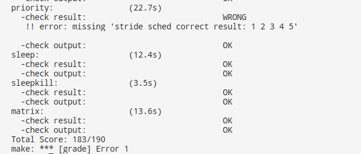
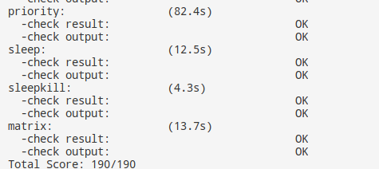

# lab7
## 【实验题目】实验8：同步互斥
## 【实验目的】  

    •	理解操作系统的同步互斥的设计实现；
    •	理解底层支撑技术：禁用中断、定时器、等待队列；
    •	在ucore中理解信号量（semaphore）机制的具体实现；
    • 	了解经典进程同步问题，并能使用同步机制解决进程同步问题。  

## 【实验要求】
    •	为了实现实验的目标，实验提供了2个基本练习，要求完成实验报告。
    •	练习0：填写已有实验
    •	练习1：理解内核级信号量的实现和基于内核级信号量的哲学家就餐问题（不需要编码）  

## 【实验方案】
### **练习0**：
实验中使用meld工具进行合并
 
### **练习1**：  

    •	完成练习0后，建议大家比较一下（可用meld等文件diff比较软件）个人完成的lab6和练习0完成后的刚修改的lab7之间的区别，分析了解lab7采用信号量的执行过程。执行 make grade, 大部分测试用例应该通过。  
    
首先我们在sem.h中找到信号量semaphore_t的结构体
```c
typedef struct {
    int value;
    wait_queue_t wait_queue;
} semaphore_t;
```
可以看到在信号量semaphore_t中存在两个重要的成员变量，一个是用于计数的value，以及一个进程等待队列wait_queue。  
同时信号量提供了4个可使用的函数  
```c
void sem_init(semaphore_t *sem, int value);
void up(semaphore_t *sem);
void down(semaphore_t *sem);
bool try_down(semaphore_t *sem);
```
分别用于初始化信号量、释放信号量、获得信号量、与尝试获得信号量。在开始这四个函数之前有两个比较重要的函数作为同步互斥的底层支撑。  
```c
static inline bool
__intr_save(void) {
    if (read_eflags() & FL_IF) {
        intr_disable();
        return 1;
    }
    return 0;
}

static inline void
__intr_restore(bool flag) {
    if (flag) {
        intr_enable();
    }


#define local_intr_save(x)      do { x = __intr_save(); } while (0)
#define local_intr_restore(x)   __intr_restore(x);
```
即local_intr_save与local_intr_restore两个函数，这两个函数分别用于关闭中断与打开中断，通过关闭中断可以避免当前进程被其他中断所打断也不会被调度，这样就能实现对临界区的互斥。  
**sem_init**:  
```c
void
sem_init(semaphore_t *sem, int value) {
    sem->value = value;
    wait_queue_init(&(sem->wait_queue));
}
```
sem_init用于对信号量初始化，在此函数中对value进行赋值并初始化wait_queue。
**up**:  
```c
static __noinline void __up(semaphore_t *sem, uint32_t wait_state) {
    bool intr_flag;
    local_intr_save(intr_flag);
    {
        wait_t *wait;
        if ((wait = wait_queue_first(&(sem->wait_queue))) == NULL) {
            sem->value ++;
        }
        else {
            assert(wait->proc->wait_state == wait_state);
            wakeup_wait(&(sem->wait_queue), wait, wait_state, 1);
        }
    }
    local_intr_restore(intr_flag);
}
void
up(semaphore_t *sem) {
    __up(sem, WT_KSEM);
}
```
up函数用于释放信号量，其主要代码逻辑如下：  

	a. 首先关闭中断，实现原子操作。
	b. 判断当前等待队列中是否有进程正在等待
		a. 若无进程等待，则将value值增加。
		b. 若有进程等待，则将队列首的进程唤醒，并从队列中删除。
	c. 打开中断  

**down**:  
```c
static __noinline uint32_t __down(semaphore_t *sem, uint32_t wait_state) {
    bool intr_flag;
    local_intr_save(intr_flag);
    if (sem->value > 0) {
        sem->value --;
        local_intr_restore(intr_flag);
        return 0;
    }
    wait_t __wait, *wait = &__wait;
    wait_current_set(&(sem->wait_queue), wait, wait_state);
    local_intr_restore(intr_flag);

    schedule();

    local_intr_save(intr_flag);
    wait_current_del(&(sem->wait_queue), wait);
    local_intr_restore(intr_flag);

    if (wait->wakeup_flags != wait_state) {
        return wait->wakeup_flags;
    }
    return 0;
}
void
down(semaphore_t *sem) {
    uint32_t flags = __down(sem, WT_KSEM);
    assert(flags == 0);
}
```
down函数用于获得信号量，其代码逻辑如下  

	a. 首先关中断并判断当前信号量是否可被获得
		a. 若信号量可被获得，则将value减1，打开中断并结束函数。
		b. 若信号量不可被获得，则将当前进程加入到等待队列中，打开中断。
	b. 若当前进程被等待，则进行调度，选择新进程。
	c. 如果当前进程被调度唤醒，则将进程从等待队列中删除。  

**try_down**:
```c
bool
try_down(semaphore_t *sem) {
    bool intr_flag, ret = 0;
    local_intr_save(intr_flag);
    if (sem->value > 0) {
        sem->value --, ret = 1;
    }
    local_intr_restore(intr_flag);
    return ret;
}
```
try_down可以非阻塞式的尝试获得信号量，若信号量可被获得则value减并返回1，否则返回0。  

    •	请在实验报告中给出给用户态进程/线程提供信号量机制的设计方案，并比较说明给内核级提供信号量机制的异同。  

用户态进程/线程提供信号量机制可以采取和内核级信号量相似的方案，在实使用类似sem_init、up、down、try_down等相似操作时通过系统调用转入内核态进行处理。  
不同：用户态使用信号量时是以系统调用的方式进入内核态进行的。
## 【实验过程】
实验环境是Ubuntu14，代码编写与调试工具是VS Code  
实验结果  
make grade  
  
关于priority.c无法通过的情况已在上一次实验报告中讨论过了，修改执行时间后顺利通过。  

