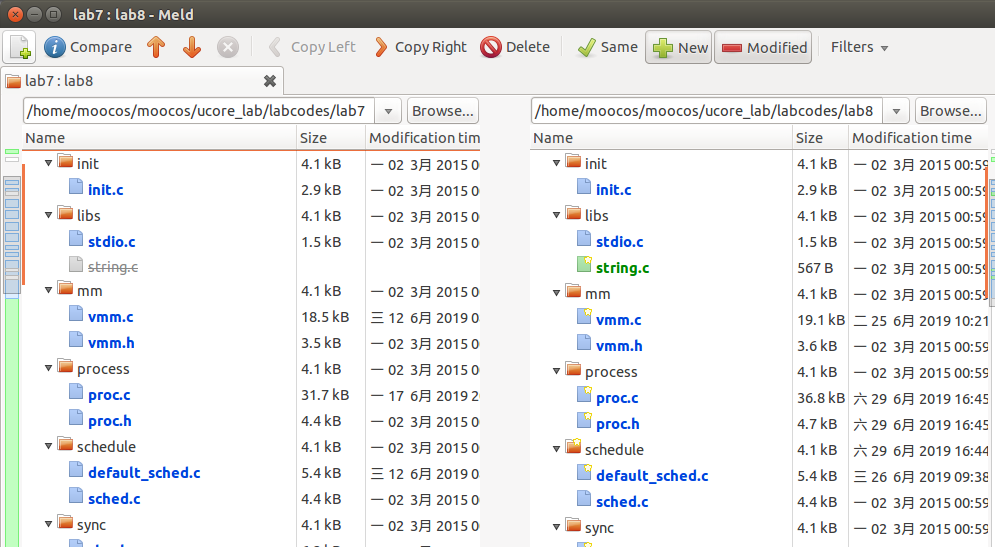
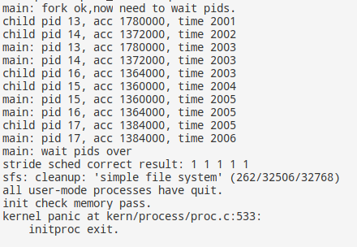

# 综合实验(lab8+反馈队列)  
## 【实验题目】Ucore综合实验
## 【实验目的】  

    •	考察对操作系统的文件系统的设计实现了解；
    •	考察操作系统内存管理的虚存技术的掌握；
    •	考察操作系统进程调度算法的实现。  

## 【实验要求】  

    •	1. 在前面ucore实验lab1-lab7的基础上，完成ucore文件系统(参见ucore_os_docs.pdf中的lab8及相关视频)；
    •	2. 在上述实验的基础上，修改ucore调度器为采用多级反馈队列调度算法的，队列共设6个优先级（6个队列），最高级的时间片为q(使用原RR算法中的时间片），并且每降低1级，其时间片为上一级时间片乘2（参见理论课）；
    •	3. （选做，加分题）在上述实验的基础上，修改虚拟存储中的页面置换算法为某种工作集页面置换算法，具体如下：
    •	对每一用exec新建进程分配3帧物理页面；
    •	当需要页面置换时，选择最近一段时间缺页次数最少的进程中的页面置换到外存；
    •   对进程中的页面置换算法用改进的clock页替换算法。
    •	在一段时间（如1000个时间片）后将所有进程缺页次数清零，然后重新计数。  

## 【实验方案】
### **题1**：  
### **实验0**：  
合并使用的工具是meld，因为lab7没有编码工作，所以有关lab7的编码（同步互斥）直接使用答案中的代码代替，避免对lab8产生影响。  
  
### **练习1**: 完成读文件操作的实现（需要编码）
    首先了解打开文件的处理流程，然后参考本实验后续的文件读写操作的过程分析，编写在sfs_inode.c中sfs_io_nolock读文件中数据的实现代码。请在实验报告中给出设计实现”UNIX的PIPE机制“的概要设方案，鼓励给出详细设计方案

根据注释我们可以发现，需要编码的部分分为三部分：  

    a. 读取首部没有按块对齐的数据
    b. 读取中间部分按块对齐的数据
    c. 读取尾部没有按块对齐的数据  

第一部分，用offset % SFS_BLKSIZE判断是否对齐，若没有对齐，则需要特殊处理，首先通过sfs_bmap_load_nolock找到这一块的inode，然后将这部分数据读出。  
```c
    if (offset % SFS_BLKSIZE != 0) {
        blkoff = offset % SFS_BLKSIZE;
        size = (nblks != 0) ? (SFS_BLKSIZE - blkoff) : (endpos - offset);
        if ((ret = sfs_bmap_load_nolock(sfs, sin, blkno, &ino)) != 0)
            goto out;
        if ((ret = sfs_buf_op(sfs, buf, size, ino, blkoff)) != 0)
            goto out;
        alen += size;
        if (nblks == 0)
            goto out;
        buf += size;
        blkno++;
        nblks--;
    }
```
第二部分比较简单，因为数据都是按块对齐的，因此每次只需要读取整个块的大小，直到读取到最后一个块  
```c
    size = SFS_BLKSIZE;
    while (nblks != 0) {
        if ((ret = sfs_bmap_load_nolock(sfs, sin, blkno, &ino)) != 0)
            goto out;
        if ((ret = sfs_block_op(sfs, buf, ino, 1)) != 0)
            goto out;
        alen += size;
        buf += size;
        nblks--;
        blkno++;
    }
```
最后一块进行扫尾操作，如果endpos%SFS_BLSIZE不为0，说明有一块数据没有对齐，需要将其读入。  
```c
    if (endpos % SFS_BLKSIZE != 0) {
        size = endpos % SFS_BLKSIZE;
        if ((ret = sfs_bmap_load_nolock(sfs, sin, blkno, &ino)) != 0) 
            goto out;
        if ((ret = sfs_buf_op(sfs, buf, size, ino, 0)) != 0)
            goto out;
        alen += size;
    }
```
### **练习2**：  

	改写proc.c中的load_icode函数和其他相关函数，实现基于文件系统的执行程序机制。执行：make qemu。如果能看看到sh用户程序的执行界面，则基本成功了。如果在sh用户界面上可以执行”ls”,”hello”等其他放置在sfs文件系统中的其他执行程序，则可以认为本实验基本成功。  
    
之前的几个函数需要被修改  
**alloc_proc**:  
需要对proc_struct中新增的成员初始化  
```c
    proc->filesp = NULL;
```
**do_fork**:  
需要判断copy_files是否成功  
```c
    if(copy_files(clone_flags, proc) != 0)
        goto bad_fork_cleanup_kstack;
```
练习2主要需要修改的是load_icode函数，主要是要实现将文件读到内存中进行执行。大部分代码可以沿用之前实验使用的代码，但是需要修改一些地方。以下是被修改的部分：  
将文件的elf文件读入内存，通过load_icode_read函数从文件中读取elf结构大小的数据。  
```c
    struct elfhdr __elf;
    struct elfhdr *elf = &__elf;
    if((ret = load_icode_read(fd, elf, sizeof(struct elfhdr), 0)) != 0)
        goto bad_elf_cleanup_pgdir;
```
根据读入的elf数据，读入程序各个段的首部。  
```c
    struct proghdr __ph;
    struct proghdr *ph = &__ph;
    uint32_t vm_flags, perm, phnum;
    for (phnum = 0; phnum < elf->e_phnum; phnum ++) {
        off_t phoff = elf->e_phoff + sizeof(struct proghdr) * phnum;
        if((ret = load_icode_read(fd, ph, sizeof(struct proghdr), phoff))!=0)
            goto bad_cleanup_mmap;
```
然后就是通过load_icode_read读取整个文件  
```c
    if((ret = load_icode_read(fd, page2kva(page)+off, size, from)) != 0)
        goto bad_cleanup_mmap;
```  
最后就是最重要的部分了，lab8需要完成对文件参数的读取，其需要以下的步骤：  
a. 首先需要读出参数所占用的空间，通过strlen函数读取字符串来确定，并将参数空间进行对齐(4字节)  
```c
    uint32_t argv_size = 0;
    int i;
    for (i=0; i<argc; i++)
        argv_size += strlen(kargv[i]) + 1;
```
b. 计算栈中保存参数需要的空间，将kargv中保存的参数写入到栈中  
```c
	uintptr_t stacktop = USTACKTOP - argv_size;
    char **uargv = (char **)(stacktop - argc * sizeof(char *));
    argv_size = 0;
    for (i=0;i<argc;i++){
        uargv[i] = strcpy((char *)(stacktop + argv_size), kargv[i]);
        argv_size += strlen(kargv[i]) + 1;
    }
```
c. 将参数的数量写入栈中  
```c
    stacktop = (uintptr_t)uargv - sizeof(int);
    *(int *)stacktop = argc;
```
d. 中断帧的栈顶设置为计算过的栈位置  
```c
    tf->tf_esp = stacktop;
```
至此文件系统的编写就完成了。  

### **题2**：
要实现多级反馈队列调度算法，根据题目的信息，可以总结一下几点：
**a. 需要实现6个不同优先级的队列，因此原本的单队列结构需要变成多队列数组，则需要改动一下传入的参数（从单指针变为数组指针）。**  
```c
	static struct run_queue *rq[6];
	static struct run_queue __rq[6];
    void (*init)(struct run_queue *rq[6]);
    // put the proc into runqueue, and this function must be called with rq_lock
    void (*enqueue)(struct run_queue *rq[6], struct proc_struct *proc);
    // get the proc out runqueue, and this function must be called with rq_lock
    void (*dequeue)(struct run_queue *rq[6], struct proc_struct *proc);
    // choose the next runnable task
    struct proc_struct *(*pick_next)(struct run_queue *rq[6]);
    // dealer of the time-tick
    void (*proc_tick)(struct run_queue *rq[6], struct proc_struct *proc);
```
将队列与参数均改为数组形式  
**b. 当高优先级程序时间片到了后，要能够将其加入到低优先级队列中，而当新程序到达时，则需要将其设置到最高优先级的队列，因此进程结构中应当有一个变量来指示这个过程。**  
```c
    int queue_num;                              // the queue place where proc in
```
queue_num存在于proc_struct中，其代表进程将被插入的队列号码  
**c. 如果高优先级队列没有进程，则向低优先级队列寻找进程，当有新进程加入时又需要执行最高优先级队列的进程，因此要有一个变量来指示这个过程。**  
```c
static int now_queue;                       //running queue number
static int new_queue;                       //will run queue number
```
now_queue是当前正在调度的优先级队列，当pick_next时会从这个队列开始往下找进程，new_queue则是当有新进程加入时，提醒调度器可能需要调度最高优先级队列的进程  
**下面进行代码分析：**  
首先是一些初始化函数需要被修改  
**alloc_proc:**  
```c
	    proc->queue_num = 0;
```
新进程应当被加入到最高级的优先级队列，因此将queue_num设为0  
**sched_init:**  
```c
    int i;
    for(i=0;i<6;i++){
        rq[i] = &__rq[i];
        rq[i]->max_time_slice = i==0?MAX_TIME_SLICE:(rq[i-1]->max_time_slice *2);
        sched_class->init(rq[i]);
    }
```
为每个优先级队列设置号其最大时间片，最高级队列为MAX_TIME_SLICE，其他队列分别为上一级的两倍   
接下来进行分析调度程序：  
```c
static void
Mutilevel_init(struct run_queue *rq) {
    list_init(&(rq->run_list));
    rq->proc_num = 0;
    now_queue = new_queue = 0;
}
```
初始化队列函数，与RR相似，但是会将now_queue和new_queue都置为0（最高级）。  
```c
static void
Mutilevel_enqueue(struct run_queue *rq[6], struct proc_struct *proc) {
    assert(list_empty(&(proc->run_link)));
    list_add_before(&(rq[proc->queue_num]->run_list), &(proc->run_link));
    if (proc->time_slice == 0 || proc->time_slice > rq[proc->queue_num]->max_time_slice) {
        proc->time_slice = rq[proc->queue_num]->max_time_slice;
    }
    proc->rq = rq[proc->queue_num];
    rq[proc->queue_num]->proc_num ++;
    if(proc->queue_num == 0)
        new_queue = 0;
}
```
入队函数，通过进程的queue_num将进程加入到相应的队列中，若当前进程为新进程(queue_num为0)，则将new_queue置0，提醒可能需要调度最高级队列，因为此时调度队列可能是低优先级的。  
```c
static void
Mutilevel_dequeue(struct run_queue *rq[6], struct proc_struct *proc) {
    assert(!list_empty(&(proc->run_link)) && proc->rq == rq[now_queue]);
    list_del_init(&(proc->run_link));
    rq[now_queue]->proc_num --;
}
```
出队函数，将进程从当前被调度的队列中去除。  
```c
static struct proc_struct *
Mutilevel_pick_next(struct run_queue *rq[6]) {
    list_entry_t *le;
    while (now_queue<6){
        le = list_next(&(rq[now_queue]->run_list));
        if (le != &(rq[now_queue]->run_list)) 
            return le2proc(le, run_link);
        now_queue++;
        new_queue = now_queue;
    }
    now_queue = 0;
    return NULL;
}
```
选择函数，从当前优先队列开始，寻找队列中是否存在等待的程序，若有，则直接返回，若没有，则将now_queue和new_queue增加，寻找更低级的队列，若最终没有进程，则将now_queue设为0，下一次从最高级队列开始查找。  
```c
static void
Mutilevel_proc_tick(struct run_queue *rq[6], struct proc_struct *proc) {
    if (proc->time_slice > 0) {
        proc->time_slice --;
    }
    if (proc->time_slice == 0) {
        proc->queue_num = proc->queue_num==5?5:(proc->queue_num+1);
        proc->need_resched = 1;
    }
    if (now_queue>new_queue){
        now_queue = new_queue;
        proc->need_resched = 1;
    }
}
```
计时函数，与RR算法相似，但是当进程时间片到了时，会将进程的queue_num增加，下一次会将其加入到更低级的优先级中。同时当now_queue>new_queue时，说明有新的进程加入了但是当前调度的是低级队列，则要将当前低优先级的进程挂起进行调度，调度的队列设为最高级的队列。  
到此，整个实验就完成了。
## 【实验过程】
实验平台是Ubuntu 14，代码编写与调试工具是VS Code  
**实验结果与分析：**  
**题1：**  
make qemu:  
   
可以成功进入到命令模式，输入ls和hello等都可以正常运行。  
**题2：**  
make run-priority  
   
可以看到进程被成功调度，同时各进程调度次数相当（因为多队列并不会受进程优先级的影响）。  
make grade:  
  
多级反馈队列并没有受到进程优先级的影响，所以priority不能通过，但是其他均正常通过，因此编写的代码没有影响到系统的正常工作。

